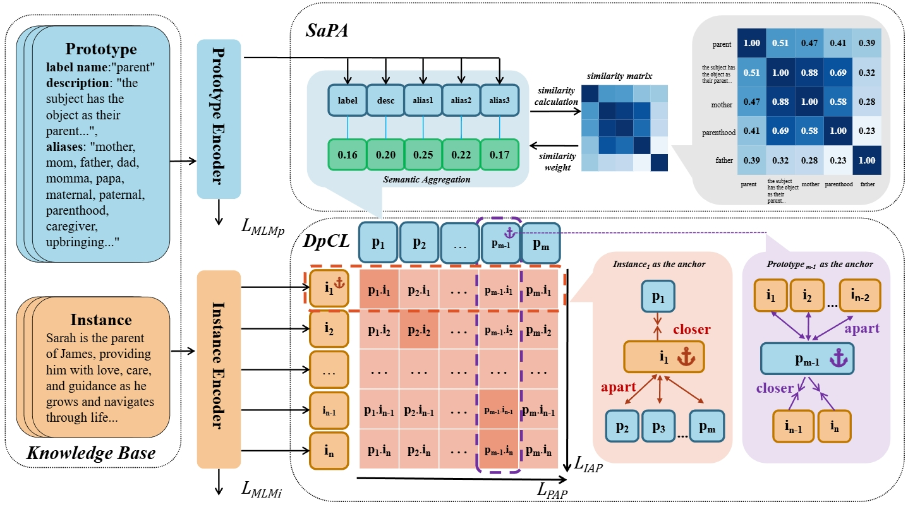
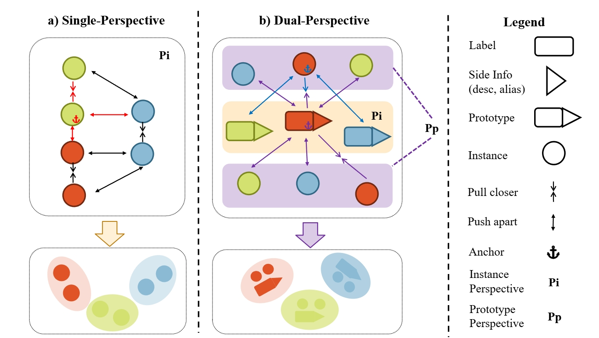

# Synergistic Anchored Contrastive Pre-training for Few-Shot Relation Extraction

## Overview






More Detailed codes will be further opened after ICIC 2025 review results


```
GPU=NVIDIA A100 Tensor Core
Python=3.7
Pytorch=1.13.0
```

## Pre-training

```shell
bash train.sh
```

## Fine-tuning


```shell
bash run_train.sh
bash run_test.sh
```
